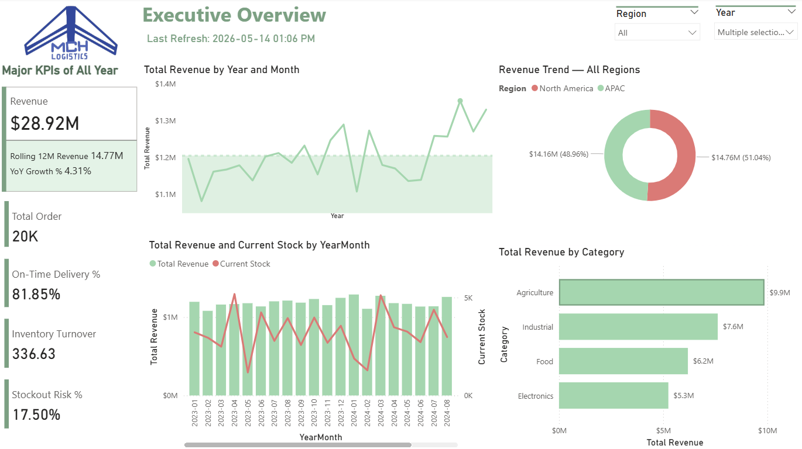

# global-supply-chain-analytics
Supply Chain Analytics - North America and APAC focused

## Business Problem

Global supply chain operations lacked centralized visibility into:

- Inventory turnover
- Supplier lead times
- Shipment performance
- Warehouse stock risks

The objective was to build an end-to-end analytics platform that enables operational and executive decision-making.

## Solution Overview

Built an end-to-end BI analytics solution using:

- Python for synthetic data generation and data cleaning
- SQL Server for dimensional modeling and ETL
- Power BI for interactive dashboards and KPI analysis
- Advanced DAX for operational metrics and time intelligence

## Data Architecture

## Key Features

- Multi-fact star schema
- Inventory turnover analysis
- Supplier risk scoring
- Logistics performance KPIs
- Advanced DAX time intelligence

## Tools Used

| Tool | Purpose |
|---|---|
| Python | Data generation & cleaning |
| SQL Server | Data warehouse |
| Power BI | Dashboarding |
| DAX | KPI calculations |
| GitHub | Portfolio hosting |

## Key KPIs

- Total Revenue
- Inventory Turnover
- Days of Inventory
- On-Time Delivery %
- Supplier Risk Score

## Skills Demonstrated

- Dimensional modeling
- ETL pipeline design
- SQL development
- Advanced DAX
- Supply chain analytics
- Dashboard storytelling

